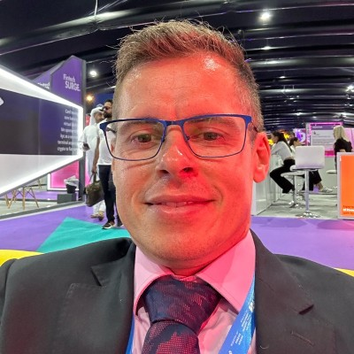

# Carlos Vitor Botti Calvi

**Founder & CEO | Empreendedor | Tecnologia & Saúde Mental | AI Software Developer**

📍 Camí dels Capellans, 77, 2-2, Sitges, Barcelona, Spain | 🎂 27/10/1980
📧 vcalvi@gmail.com | 📱 +34 672962737
🔗 [GitHub: vitorcalvi](https://github.com/vitorcalvi)

---

## Experiência Profissional

### **Founder & CEO**
**Dyagnosys Health (DYAGSOFTWARE LTDA)** | Brasília - DF | *2021 - Presente*

Empresa de tecnologia em saúde mental focada em prevenção de burnout e aumento de produtividade empresarial.

- Desenvolvimento de soluções de IA para detecção precoce de estresse e burnout
- Liderança de equipe técnica e gestão estratégica
- Relações internacionais e cooperação bilateral Brasil-Suíça
- Busca de investimento de US$ 2M para expansão em UAE e Índia
- Compliance internacional (GDPR, PDPL, HIPAA)

---

## Educação

### Pós-Graduação / MBAs
- **Post MBA em Inteligência Empresarial** - FGV | *Dezembro/2017*
- **MBA em Gestão Empresarial (Lato Sensu)** - FGV/EBAPE | *Maio/2019*
- **MBA em Gestão Financeira (Lato Sensu)** - Universidade Candido Mendes/ESPG | *Dezembro/2019*

### Bacharelado
- **Bacharel em Sistemas de Informação** - Universidade Estácio de Sá | *Agosto/2015*
- **Bacharel em Administração** - Faculdade Estácio de Sá - Vitória | *Agosto/2013*

---

## Certificações

### Coaching e Desenvolvimento Pessoal
- **Professional & Life Coach** (Certificação Internacional) - EBRA | *Junho/2017*
- **Líder Coach** - EBRA Coaching | *Novembro/2015*
- **Practitioner em Programação Neurolinguística (100h)** - EBRA | *Junho/2017*
- **Empretec (60h)** - SEBRAE/ES | *Julho/2007*

### Tecnologia e Infraestrutura
- **Microsoft Certified Professional**
- **Security for Microsoft Networks (24h)** - Mindworks | *Setembro/2006*
- **Implementing and Managing Microsoft Exchange Server 2003 (40h)** - Mindworks | *Maio/2006*
- **Implementing a Microsoft Windows Server 2003 Net Infrastructure** | *Fevereiro/2006*
- **Administração de Servidores Linux** - Libertos Treinamento | *Abril/2005*
- **Cabeamento Estruturado FCP (40h)** - Furukawa | *Janeiro/2006*
- **Instalação e Programação Centrais PANASONIC TDE e NCP** - Multiport/Panasonic | *Fevereiro/2011*

### Qualidade e Gestão
- **Preparação do Laboratório para Implantação de Sistema de Gestão da Qualidade** - PNCQ/SBAC | *Setembro/2018*

---

## Projetos & Parcerias

### Cooperação Bilateral Brasil-Suíça 2023
**TechMakers, ApexBrasil, Embrapii e Innosuisse**

Projeto "Monitoring, Protecting, Healing Mental Health" com cooperação internacional entre Brasil e Suíça.

- **Parceiros Brasileiros:** UFMG, UNIVERTIX
- **Parceiros Suíços:** HUG Genebra, Manufacture Modules Technologies SA
- **Objetivo:** Co-desenvolvimento de sistema de monitoramento contínuo de saúde mental via IA
- **Reconhecimento:** Carta oficial de apoio da ApexBrasil

### POC Petrobras
Implementação piloto da tecnologia Dyagnosys em grande corporação.

- Tecnologia validada clinicamente com **82% de precisão**
- Demonstração de escalabilidade e eficácia em ambientes corporativos

### Parceria EMBRAPII
Projeto de pesquisa em andamento com a rede de 60 unidades de pesquisa da EMBRAPII.

- **Status:** Projeto confirmado (Junho/2024)
- **Objetivo:** Utilizar recursos especializados para desenvolver tecnologias inovadoras

### Apoio SEBRAE
Contrato SEBRAE 345/2021 - Projeto "Monitoramento de Parâmetros de Saúde Mental".

- **Código EMBRAPII:** NDCC-2403.00105
- **Suporte:** GENER (Gerência de Negócios em rede) - SEBRAE DF
- **Atendimento anterior:** SEBRAE CEARÁ e PARAÍBA (convergência para mercado de saúde)

---

## Competências

### Empreendedorismo & Negócios
- Liderança de startups e gestão de equipes técnicas
- Relações internacionais e cooperação bilateral
- Captação de recursos e venture capital
- Estratégia de mercado e expansão internacional
- Parcerias bilaterais e alianças estratégicas
- Compliance regulatório (GDPR, PDPL, HIPAA)

### Tecnologia
- **IA e Machine Learning:** Desenvolvimento de algoritmos, detecção biométrica
- **Desenvolvimento de Software:** Arquitetura, design, implementação
- **Infraestrutura:** Windows Server, Linux, Redes, Segurança
- **Programação:** Visual Basic, análise de dados, computação biométrica

### Desenvolvimento Humano
- Coaching executivo e life coaching
- Programação Neurolinguística (PNL)
- Gestão de equipes e liderança
- Saúde mental corporativa e bem-estar
- Empreendedorismo e inovação

### Produtos Desenvolvidos
- **AI-GAD-7:** Ferramenta de detecção de estresse via câmera e microfone
- **GAD-7 Questionnaire:** Avaliação digital de ansiedade
- **Team Stress & Anxiety Index (TSAI):** Índice agregado e anonimizado para RH
- **Screening On-Device:** Processamento local para privacidade (dados não saem do dispositivo)

---

## Idiomas

| Idioma | Nível |
|---------|--------|
| Português | Nativo |
| Inglês | Avançado |

---

## Resumo Profissional

Founder & CEO da **Dyagnosys Health**, empresa de tecnologia em saúde mental reconhecida internacionalmente.

Combina sólida formação acadêmica em Administração e Sistemas de Informação (três MBAs - FGV) com certificações avançadas em Coaching e Programação Neurolinguística. Liderou projeto de **cooperação bilateral Brasil-Suíça** com apoio oficial da ApexBrasil, Embrapii e Innosuisse, desenvolvendo parcerias com instituições como UFMG, UNIVERTIX e HUG Genebra.

Desenvolveu tecnologia de IA validada clinicamente (**82% de precisão**) implementada em POC da Petrobras. Experiência robusta em gestão empresarial, desenvolvimento de software, relações internacionais e captação de investimentos para expansão em mercados estratégicos (Emirados Árabes Unidos, Índia, Europa).

**Empresa:** DYAGSOFTWARE LTDA | CNPJ: 41.922.920/0001-44 | Brasília - DF | Ativa desde Maio/2021

---

*Última atualização: Março/2026*
